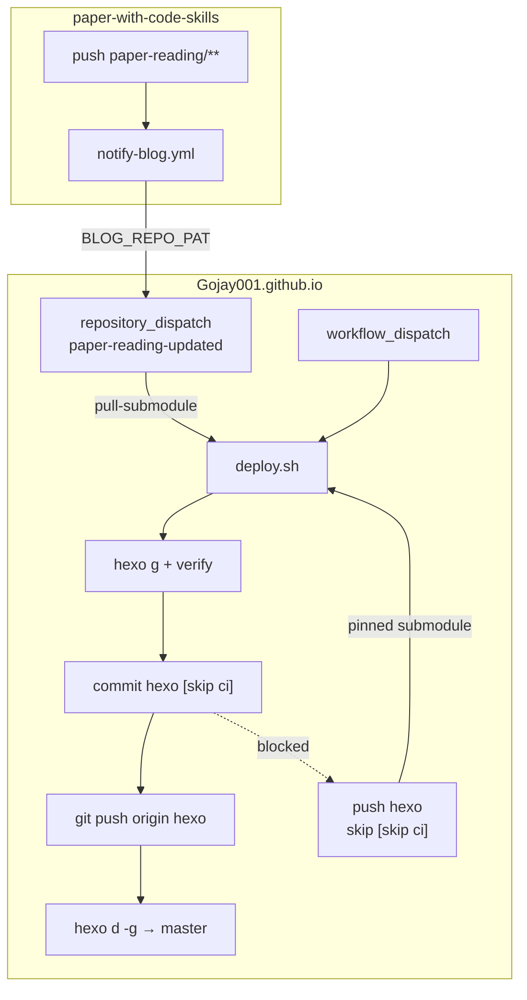

# Hexo 博客 CI/CD 自动部署设计

**日期：** 2026-06-17  
**状态：** 待实现  
**依赖：** [2026-06-17-paper-reading-deploy-design.md](./2026-06-17-paper-reading-deploy-design.md)（已实现）

## 背景

博客源码在 `hexo` 分支，静态站通过 `hexo-deployer-git` 部署到 `master`（`gojay.top`）。  
论文精读 HTML 来自 git 子模块 `submodule/paper-with-code-skills`，本地已有 skill 脚本：

```bash
skills/hexo-paper-reading-deploy/scripts/deploy.sh --pull-submodule
```

流程：拉子模块 → `hexo g` → commit 子模块指针 + 桥接 md → `hexo d -g`。

**痛点：** 子模块 push 新手写 md 后，需人工回到博客仓库执行 skill。希望 CI 自动检测并完成同样流程。

## 已确认决策

| 决策项 | 选择 |
|--------|------|
| 子模块更新检测 | **A** — `paper-with-code-skills` push 事件驱动 |
| CI 回写 | **A1** — commit + push `hexo`，并 deploy `master` |
| 触发范围 | **B2** — 子模块 dispatch **或** `hexo` push 均 deploy |
| 跨仓库方案 | **方案 1** — `repository_dispatch`（推荐） |

## 目标

| 需求 | 说明 |
|------|------|
| 子模块自动 sync | 子模块 push 精读 HTML 后，博客 CI 拉 remote、`hexo g`、回写 `hexo`、deploy `master` |
| 普通博文自动 deploy | 用户 push `hexo`（手写 md、主题、配置）后，CI 自动 `hexo d -g` |
| 行为一致 | CI 路径复用 `deploy.sh`，与本地 skill 等价（含增量 sync、verify） |
| 防循环 | bot commit 不得再次触发 deploy |
| 手动兜底 | `workflow_dispatch` 可选手动触发 |

## 非目标

- GitLab CI / 自建 Jenkins（首期仅 GitHub Actions）
- 替换本地 skill（CI 与本地并存）
- 子模块仓库内直接 build Hexo（build 只在博客仓库）
- 自动合并 PR（直接 push `hexo` / `master`）
- Coding.net 双端 deploy（现有 `_config.yml` 中 coding 仍注释，CI 不启用）
- 部署前人工审批 gate

## 架构



### 组件

| 组件 | 仓库 | 职责 |
|------|------|------|
| `notify-blog.yml` | `paper-with-code-skills` | 精读路径变更时 `repository_dispatch` |
| `hexo-deploy.yml` | `Gojay001.github.io` | dispatch / push / manual 统一入口 |
| `deploy.sh` | 博客（小改） | CI push hexo、`[skip ci]`、git 身份 |
| Secrets | 两仓库 Settings | SSH deploy key、跨仓库 PAT |

### 运行模式

| 触发 | deploy.sh 参数 | 行为 |
|------|----------------|------|
| `repository_dispatch` | `--pull-submodule` | `submodule update --remote` → sync md → commit → push hexo → deploy master |
| `push` → `hexo` | （无 pull） | 用 pinned gitlink → generate → deploy master |
| `workflow_dispatch` | 按 input | 可选 `--pull-submodule` |
| bot sync commit | — | push workflow 跳过（`[skip ci]`） |

## Secrets 与权限

### 博客仓库 `Gojay001.github.io`

| Secret | 用途 | 配置 |
|--------|------|------|
| `HEXO_DEPLOY_KEY` | `hexo d -g` SSH 推 `master` | ed25519 key；Deploy key 勾选 **Allow write access** |
| `SUBMODULE_PAT` | 仅当子模块为 **私有** 时 checkout / `--remote` | Fine-grained：子模块 Contents read |

`hexo` 回写使用 workflow `GITHUB_TOKEN`（`permissions: contents: write`）。

### 子模块仓库 `paper-with-code-skills`

| Secret | 用途 | 配置 |
|--------|------|------|
| `BLOG_REPO_PAT` | 发 `repository_dispatch` | Fine-grained：`Gojay001.github.io` Contents + Actions write |

## Workflow 规范

### 子模块：`notify-blog.yml`

```yaml
name: Notify blog deploy

on:
  push:
    branches: [main]   # 按子模块默认分支调整
    paths:
      - 'paper-reading/**'
      - 'paper-with-code-list.md'

jobs:
  dispatch:
    runs-on: ubuntu-latest
    steps:
      - name: Trigger blog repository_dispatch
        env:
          PAT: ${{ secrets.BLOG_REPO_PAT }}
        run: |
          curl -sf -X POST \
            -H "Authorization: token ${PAT}" \
            -H "Accept: application/vnd.github+json" \
            https://api.github.com/repos/Gojay001/Gojay001.github.io/dispatches \
            -d '{"event_type":"paper-reading-updated","client_payload":{"source_sha":"'"${{ github.sha }}"'"}}'
```

### 博客：`hexo-deploy.yml`

**Triggers:**

- `repository_dispatch`: `types: [paper-reading-updated]`
- `push`: `branches: [hexo]`，`if: !contains(github.event.head_commit.message, '[skip ci]')`
- `workflow_dispatch`: input `pull_submodule` (boolean, default false)

**Concurrency:**

```yaml
concurrency:
  group: hexo-deploy
  cancel-in-progress: false
```

**Job steps（概要）:**

1. `actions/checkout@v4` — `ref: hexo`, `submodules: recursive`
2. `actions/setup-node@v4` — Node 20, `cache: npm`
3. `webfactory/ssh-agent@v0.9.0` — `HEXO_DEPLOY_KEY`
4. `npm ci`（或 deploy.sh 内 `npm install`）
5. `deploy.sh` — 按触发源传参
6. 失败时 job exit 1（GitHub 默认通知）

**模式选择逻辑:**

```bash
if [[ "${{ github.event_name }}" == "repository_dispatch" ]]; then
  EXTRA="--pull-submodule"
elif [[ "${{ github.event_name }}" == "workflow_dispatch" && "${{ inputs.pull_submodule }}" == "true" ]]; then
  EXTRA="--pull-submodule"
fi
skills/hexo-paper-reading-deploy/scripts/deploy.sh ${EXTRA}
```

## deploy.sh 变更

| 变更 | 说明 |
|------|------|
| `CI=true` 时 `git push origin hexo` | 满足 A1；本地默认不 push |
| commit message 追加 `[skip ci]` | 防 B2 循环 |
| CI 下 `git config user.name/email` | `github-actions[bot]` |
| `--push-hexo` | 显式启用 push hexo（CI 默认开） |
| verify 失败 `exit 1` | CI 必须 fail job（已有 `fail` 变量，确保非 local-only 时传播） |

**dispatch early-exit（推荐启用）：**

在 `--pull-submodule` 且 `CI=true` 时：

1. 记录 `OLD=$(git rev-parse submodule/paper-with-code-skills)`
2. `git submodule update --remote`
3. `NEW=$(git rev-parse submodule/paper-with-code-skills)`
4. 若 `OLD == NEW` 且无其他 staged 变更 → log `no submodule update, skip` → `exit 0`

避免重复 dispatch 或空 rebuild 浪费 runner。`hexo` push 路径不启用此 early-exit（用户可能只改了 md）。

## 防循环（三层）

| 层 | 机制 |
|----|------|
| 1 | 子模块 notify 仅 `paths: paper-reading/**`, `paper-with-code-list.md` |
| 2 | bot commit message 含 `[skip ci]` |
| 3 | push workflow `if: !contains(github.event.head_commit.message, '[skip ci]')` |

**预期时序（子模块 push 一次）：**

1. 子模块 push → dispatch → 博客 workflow #1
2. #1 commit `[skip ci]` + push hexo → push workflow **跳过**
3. #1 `hexo d -g` push master → 不触发 hexo workflow

## 测试计划

### 上线前（本地 / dry-run）

| # | 步骤 | 期望 |
|---|------|------|
| T1 | `deploy.sh --local-only --pull-submodule` | verify 通过 |
| T2 | 模拟 CI：`CI=true` + deploy.sh，检查 commit message 含 `[skip ci]` | 格式正确 |
| T3 | 配置 Secrets 后 `workflow_dispatch` + pull=false | master 更新 |

### 上线后（集成）

| # | 场景 | 期望 |
|---|------|------|
| T4 | 子模块 push 新 `{slug}.html` | ~3–5 min 内 gojay.top 可访问 `/paper-reading/{slug}.html` |
| T5 | T4 后检查 hexo 分支 | gitlink + `source/_posts/paper-reading/{slug}.md` 已 commit |
| T6 | hexo push 新手写 md | 首页可见，无 `--pull-submodule` |
| T7 | 子模块 push 非 paper-reading 路径 | 不 dispatch |
| T8 | 重复 dispatch（gitlink 未变） | early-exit，job 成功且快速 |

### 失败场景

| 场景 | 期望 |
|------|------|
| `HEXO_DEPLOY_KEY` 无 write | job fail，日志 SSH permission denied |
| `hexo g` ERROR | job fail |
| `BLOG_REPO_PAT` 无效 | 子模块 notify job fail |

## 上线步骤

1. **博客仓库**
   - 生成 Deploy key → 设 `HEXO_DEPLOY_KEY`
   - 新增 `.github/workflows/hexo-deploy.yml`
   - 修改 `deploy.sh`（CI 适配）
   - 更新 `SKILL.md`、`README.md`
   - merge 到 `hexo`，手动 `workflow_dispatch` 验证

2. **子模块仓库**（单独 PR）
   - 设 `BLOG_REPO_PAT`
   - 新增 `notify-blog.yml`
   - push 测试 HTML → 观察博客 Actions

3. **回滚**
   - 禁用 workflow 或 revert YAML
   - 本地 skill 仍可 deploy
   - `master` 可用 git revert 回滚

## 文件清单

| 文件 | 操作 |
|------|------|
| `.github/workflows/hexo-deploy.yml` | 新增 |
| `skills/hexo-paper-reading-deploy/scripts/deploy.sh` | 修改 |
| `skills/hexo-paper-reading-deploy/SKILL.md` | 修改 |
| `README.md` | 修改 |
| `paper-with-code-skills/.github/workflows/notify-blog.yml` | 新增（子模块仓库） |

## 参考

- 本地 deploy skill：`skills/hexo-paper-reading-deploy/SKILL.md`
- Paper reading 设计：`docs/superpowers/specs/2026-06-17-paper-reading-deploy-design.md`
- Hexo deploy 配置：`_config.yml` → `deploy.type: git`, `branch: master`
