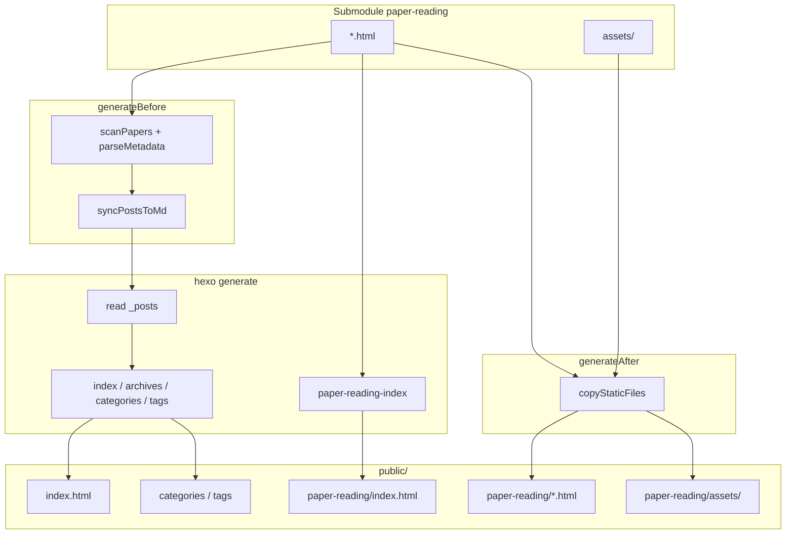

# Paper Reading 静态页部署设计

**日期：** 2026-06-17  
**修订：** 2026-06-17 v2 — 增加 `_posts` 博文桥接，首页 feed 展示  
**状态：** v2 已实现（本地验证通过）

## 背景

博客通过 Hexo 将 `source/_posts/` 下的 Markdown 渲染为静态站点，部署到 `gojay.top`。  
论文精读 HTML 由 `paper-with-code-skills` 仓库中的 `paper-logic-reading` skill 生成，存放在 git submodule：

```
submodule/paper-with-code-skills/paper-reading/
```

精读页是独立 HTML（三栏批注、内联样式），不适合直接当 Hexo 博文渲染。但用户希望精读论文也能像普通博文一样出现在**首页列表、Archives、Categories、Tags** 中，展示标题与简介；点击正文时再跳转到原始精读页 `/paper-reading/{slug}.html`。

## 目标

| 需求 | 说明 |
|------|------|
| 首页集成 | 精读论文以博文卡片形式出现在首页，含 excerpt、categories、tags |
| 正文跳转 | 从列表/卡片点击进入 `/paper-reading/{slug}.html` 原始 HTML，不经 Hexo 文章页 |
| 精读页样式 | 原始 HTML 保持独立样式，不经主题渲染 |
| 规模 | 未来会有很多篇；扫描 HTML 自动同步，无需手改清单 |
| HTML 唯一来源 | submodule 为精读 HTML 唯一来源；不在 `source/` 复制 HTML |
| MD 同步 | 构建前扫描 HTML，在 `source/_posts/` 自动生成/更新对应 `.md` 桥接博文 |
| 更新流程 | submodule 生成 HTML → 更新 submodule 指针 → `hexo g` / `hexo d -g` |

## 非目标

- 将三栏精读 HTML 全文转换为 Hexo Markdown 正文
- 精读页套用 Icarus 文章布局
- 独立子域名或第二套部署流水线
- 自动合并/替换用户手写的同名 `_posts` 博文（通过命名空间隔离）

## 方案概览

采用 **双通道部署**：

1. **博文桥接通道** — `generateBefore` 根据 HTML 同步 `source/_posts/paper-reading/*.md`，让 Hexo 正常生成 feed、分类、标签页
2. **静态精读通道** — `generateAfter` 将 HTML + `assets/` 原样复制到 `public/paper-reading/`（保留 v1 能力）

可选保留 `/paper-reading/` 索引页作为精读专题入口（与首页 feed 互补）。

```
submodule/.../paper-reading/
    ├── ddpm.html
    ├── {slug}.html
    └── assets/{slug}/...

        ↓  generateBefore（同步 md）

source/_posts/paper-reading/
    └── {slug}.md          ← 桥接博文（front matter + excerpt）

        ↓  hexo generate（常规流程）

public/
    ├── index.html         ← 首页含精读博文卡片
    ├── categories/...     ← 含 Paper Reading 等分类
    ├── tags/...           ← 含 Paper Reading 等标签
    └── paper-reading/
        ├── index.html     ← 可选专题索引
        ├── ddpm.html      ← 原样复制
        └── assets/...
```

## URL 与跳转行为

| 场景 | URL | 行为 |
|------|-----|------|
| 首页 / Archives / Categories / Tags 卡片标题 | — | 跳转 `link` 字段：`/paper-reading/{slug}.html` |
| 首页 excerpt「Read more」 | — | 同上（需主题小改，见下文） |
| 精读正文 | `/paper-reading/{slug}.html` | 展示原始 HTML |
| 博文 permalink（若被直接访问） | `/YYYY/MM/DD/{slug}/` | 显示 excerpt + 显眼「阅读精读」按钮，或 JS 跳转至 `link` |
| 专题索引（可选） | `/paper-reading/` | Icarus 主题列表页 |

### 博文桥接 front matter 示例

以 `ddpm.html` 为例，自动生成 `source/_posts/paper-reading/ddpm.md`：

```yaml
---
title: DDPM — Denoising Diffusion Probabilistic Models
date: 2026-06-17 17:41:00
categories:
  - DeepLearning
  - Paper Reading
  - DDPM
tags:
  - DL
  - Paper Reading
  - Diffusion Model
link: /paper-reading/ddpm.html
paper_reading: true
thumbnail: /paper-reading/assets/ddpm/fig2_pgm.png
---

> 想象一个「倒放」游戏：先把一张清晰照片一帧帧泼上雪花噪点……（费曼速读首段摘要）
<!-- more -->

[阅读完整精读页面 →](/paper-reading/ddpm.html)
```

**关键字段：**

| 字段 | 来源 | 作用 |
|------|------|------|
| `title` | HTML `<title>`，去掉 `title_suffix` | 列表标题 |
| `date` | HTML 文件 `mtime`（或后续 HTML 内嵌注释） | 排序、归档 |
| `categories` | 规则解析（见下） | 分类页统计 |
| `tags` | 规则解析（见下） | 标签页统计 |
| `link` | `/{url_path}/{slug}.html` | Icarus 列表页外链跳转 |
| `paper_reading: true` | 固定标记 | 主题识别桥接博文，修正「Read more」等行为 |
| `thumbnail` | `assets/{slug}/` 下首张图片（若存在） | 首页卡片缩略图 |
| excerpt 正文 | `#feynman` 首段 `<p>` 文本 | 首页简介 |

## HTML 元数据解析规则

### 标题

```html
<title>DDPM — Denoising Diffusion Probabilistic Models · 逻辑精读</title>
```

去掉配置的 `title_suffix`（` · 逻辑精读`）→ `DDPM — Denoising Diffusion Probabilistic Models`

### 分类（categories）

解析 `.top-nav .meta` 行，例如：

```html
<div class="meta">DeepLearning-Paper-with-Code · Diffusion Model · arXiv(2020) / NeurIPS(2020)</div>
```

规则：

1. 固定插入二级分类 `Paper Reading`
2. 第一段 `DeepLearning-Paper-with-Code`：取首个 `-` 前 token → `DeepLearning`
3. 第三级：从标题提取缩写（`DDPM`）或 slug 大写化
4. 最终示例：`[DeepLearning, Paper Reading, DDPM]`

解析失败时回退：`[Paper Reading, {SLUG}]`

### 标签（tags）

1. 将 `.meta` 按 ` · ` 拆分，去掉纯年份/会议括号段（如 `arXiv(2020) / NeurIPS(2020)`）
2. 固定追加 `Paper Reading`
3. 若 meta 含 `DeepLearning` 语义，追加 `DL`
4. 最终示例：`[DL, Paper Reading, Diffusion Model]`

### 简介（excerpt）

提取 `<section class="feynman" id="feynman">` 内**第一个** `<p>` 的纯文本（去 HTML 标签），写入 md 正文为 blockquote：

```markdown
> {feynman_first_paragraph}
<!-- more -->
```

超过 300 字时截断并加 `…`。

### 缩略图（thumbnail）

若存在 `assets/{slug}/` 下首个 `.png/.jpg/.webp`，设为：

```yaml
thumbnail: /paper-reading/assets/{slug}/{filename}
```

路径指向部署后的静态资源（`generateAfter` 复制后可用）。

## 配置

根目录 `_config.yml`：

```yaml
paper_reading:
  source_dir: submodule/paper-with-code-skills/paper-reading
  url_path: paper-reading
  posts_dir: source/_posts/paper-reading   # 桥接 md 输出目录
  title_suffix: " · 逻辑精读"
  index_title: Paper Reading
  index_subtitle: Triple-column logic annotations · paper-logic-reading skill
  sync_posts: true                         # 是否同步生成桥接 md
```

| 字段 | 作用 |
|------|------|
| `source_dir` | submodule 内精读 HTML 根目录 |
| `url_path` | 静态精读页 URL 前缀 |
| `posts_dir` | 桥接 md 输出目录（相对项目根） |
| `title_suffix` | 从 `<title>` 剥离的后缀 |
| `sync_posts` | 开关：关闭则仅复制静态 HTML，不生成 md |

## 组件

### 1. `scripts/paper-reading.js`（扩展）

#### `hexo.on('ready')`：增量同步桥接 md

1. 读取 `.sync-state.json` 中的 `submodule_commit`
2. **commit 未变**：跳过，不扫描 HTML
3. **commit 变化**：`git diff --name-status <old> <new> -- paper-reading/`，仅对变更的 `.html` 增量生成/删除 md
4. **首次运行或 diff 失败**：全量同步
5. 仅当 md 内容变化时写入文件

触发时机：`hexo.on('ready')`（早于 Hexo `source.process()`）。

#### `paper-reading-index` generator（保留，可选）

专题索引页 `/paper-reading/`，布局 `paper-reading-index.ejs`。

#### `generateAfter`：复制静态文件（保留 v1）

将 HTML + `assets/` 复制到 `public/{url_path}/`，跳过 `index.html`。

### 2. 主题小改：`themes/icarus/layout/common/article.ejs`

Icarus 已支持 `post.link` 用于首页/归档**标题与缩略图**链接，但「Read more」仍指向 `post.path`。需修改：

```ejs
href="<%- url_for(post.link ? post.link : post.path) %>"
```

用于「Read more」按钮（约第 102 行），使 `link` 博文的 more 也跳转到精读页。

### 3. 博文 permalink 页（可选增强）

当 `post.paper_reading && post.link` 时，在文章顶部显示：

```html
<a href="/paper-reading/ddpm.html">阅读完整精读页面 →</a>
```

或在 `post.ejs` / `article.ejs` 中对 `paper_reading` 博文做 `location.replace(post.link)` 自动跳转。  
**推荐**：显示 CTA 按钮 + 简短 excerpt，不强制自动跳转（利于 SEO / RSS 摘要）。

### 4. `source/_posts/paper-reading/.sync-state.json`

记录上次同步的 submodule commit，随仓库提交：

```json
{
  "submodule_commit": "de72cbae72dc0fa6ddfd6125c36a71f0f32ff4b4",
  "submodule_path": "submodule/paper-with-code-skills",
  "paper_reading_dir": "paper-reading",
  "synced_at": "2026-06-17T12:35:57.428Z"
}
```

### 5. `.gitignore`

`source/_posts/paper-reading/` **不再忽略**，桥接 md 与 sync state 均由 git 管理。

## 数据流



## 日常操作

### 新增一篇精读

1. 在 submodule 中用 skill 生成 `{slug}.html` 及 `assets/{slug}/`
2. submodule 仓库 commit & push
3. 博客仓库更新 submodule 指针并 commit
4. 构建（自动生成 md + 静态页）：

   ```bash
   git submodule update --init
   npx hexo clean && npx hexo g
   ```

5. 验证：
   - 首页出现新卡片，categories/tags 有更新
   - 点击标题跳转到 `/paper-reading/{slug}.html`
6. 部署：`npx hexo d -g`

### 新克隆博客仓库

```bash
git clone --recurse-submodules <repo>
cd <repo>
npm install
npx hexo g    # generateBefore 会自动创建 source/_posts/paper-reading/*.md
```

## 测试验证

```bash
npx hexo clean && npx hexo g

# 1. 桥接 md 已生成
ls source/_posts/paper-reading/
# 期望：ddpm.md

# 2. 首页含精读博文
rg "DDPM" public/index.html

# 3. 分类/标签页
rg "Paper Reading" public/categories/ public/tags/

# 4. 列表链接指向精读页
rg 'href="/paper-reading/ddpm.html"' public/index.html

# 5. 静态精读页与资源
test -f public/paper-reading/ddpm.html
test -f public/paper-reading/assets/ddpm/fig2_pgm.png

# 6. 构建日志
# 期望：paper-reading: synced 1 post(s) to source/_posts/paper-reading/
# 期望：paper-reading: deployed 1 page(s) to /paper-reading/
```

## 已知限制

- categories/tags 依赖 HTML `.meta` 行启发式解析，格式变化时需调整规则
- 桥接 md 为自动生成，不宜手改；定制分类需后续 overrides 机制
- 博文 permalink 页仍存在（Hexo 默认），但非主入口；通过 `link` 引导至精读页
- RSS 条目仍指向 permalink，非精读页（可后续用 `link` 覆盖）
- 部署环境必须初始化 submodule

## 变更文件清单

| 文件 | v1 | v2 |
|------|----|----|
| `_config.yml` | `paper_reading` 配置块 | 增加 `posts_dir`、`sync_posts` |
| `scripts/paper-reading.js` | generator + copy | 增加 `generateBefore` md 同步、元数据解析 |
| `themes/icarus/layout/paper-reading-index.ejs` | 专题索引 | 保留 |
| `themes/icarus/_config.yml` | 导航 Paper Reading | 保留 |
| `themes/icarus/layout/common/article.ejs` | — | 修正 Read more 使用 `post.link` |
| `.gitignore` | — | 可选忽略 `source/_posts/paper-reading/` |
| `docs/superpowers/specs/2026-06-17-paper-reading-deploy-design.md` | 设计文档 | 本文档 |

## 版本历史

| 版本 | 说明 |
|------|------|
| v1 | 静态复制 HTML + `/paper-reading/` 专题索引 |
| v2 | 增加 `_posts` 桥接博文，首页 feed / categories / tags 集成，`link` 跳转精读页 |
